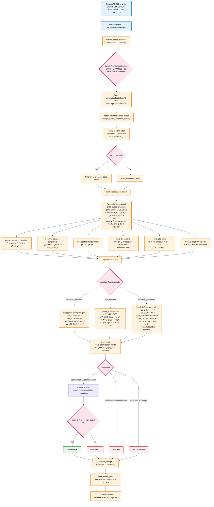

# Optimization-Based AC Power Flow in o-grid

This document describes the **optimization-based** AC power-flow solver that
`o-grid` uses as an alternative to the direct (equation-based) Newton-Raphson
and Fast-Decoupled methods. Instead of iterating on the power-mismatch
equations, the solver poses the power flow as a **nonlinear program (NLP)** and
solves it with Pyomo + Ipopt. It covers the complete mathematical formulation —
sets, parameters, variables, the network equations, every constraint, and the
objective — the way the pieces connect into a converging system, and a
comparison against the Newton-Raphson and Fast-Decoupled solvers.

The implementation lives in
[`src/o_grid/acpf/optimization.py`](src/o_grid/acpf/optimization.py); case
construction and the switch/jumper network reduction are shared with the other
solvers in [`src/o_grid/acpf/models/`](src/o_grid/acpf/models/). All quantities
are per-unit on the case base `BASE` (MVA) unless noted otherwise. Familiarity
with the power-flow problem statement and the ANAREDE case construction of
[NEWTON-RAPHSON.md](NEWTON-RAPHSON.md) (§1, §3) is assumed. LCC-HVDC links,
controllable series compensators, and closed switches enter the model as fixed
network modifications before the NLP is built (§12); the solver also exposes
three objective-function modes (`minimize_residuals`, `zero_function`,
`squared_generation`, §6.1).

---

## 1. The optimization point of view

The classic load-flow problem is a **square system of nonlinear equations**: for
every bus, two equations ($\Delta P = 0$, $\Delta Q = 0$) in two unknowns
($V_i$, $\theta_i$, minus the two fixed at the slack). Direct methods linearize
the equations (Newton) or decouple them (Fast-Decoupled) and iterate; they can
diverge, hit a singular Jacobian, or require a good initial guess.

The optimization formulation instead writes the balance residuals as **decision
variables** (signed slack variables), bounds them by the declared convergence
tolerances, and lets Ipopt minimize a weighted least-squares objective. Three
consequences follow:

* **A solution is always reported.** If the exact power balance is
  unattainable, Ipopt returns the closest feasible operating point instead of
  failing, and `solution_metrics` reports the achieved residuals.
* **Convergence is a constraint, not a side effect.** The per-bus residual
  tolerance constraints *enforce* the same convergence threshold the direct
  solvers only check afterwards.
* **Controls are part of the optimization.** Static VAR compensators (droop
  equations), Q-limited generators (bounded reactive variables), and soft
  voltage/angle limits are modeled directly as variables and constraints, so no
  outer discrete control loop is needed.

## 2. Formulation: sets, parameters, variables

### 2.1 Sets

| Set | Index | Meaning |
| --- | --- | --- |
| $\mathcal{B}$ (`BUS`) | $i$ | All buses of the reduced case |
| $\mathcal{Q}$ (`QPV`) | $i$ | Bounded-Q generator (PV) buses |
| $\mathcal{L}$ (`BRANCH`) | $\ell$ | All branches |
| $\mathcal{S}$ (`SVC`) | $s$ | Static VAR compensators |

The bus-type code is $t_i \in \{\mathrm{SLACK}, \mathrm{PV}, \mathrm{PQ}\}$,
mapped from the ANAREDE `DBAR` kind
(`_bus_type_code`): `REF`/`SLACK` → `SLACK`, `PV` → `PV`, everything else → `PQ`.

### 2.2 Parameters

| Parameter | Meaning |
| --- | --- |
| `base_mva` | System base power $S_{base}$ (p.u. normalization) |
| `angle_limit` | $\theta^{max} = \pi/2$ rad |
| `active_tolerance` | $\varepsilon_P$ — active convergence tolerance (p.u.) |
| `reactive_tolerance` | $\varepsilon_Q$ — reactive convergence tolerance (p.u.) |
| `control_tolerance` | $\varepsilon_C$ — SVC control convergence tolerance (p.u.) |
| `weight_*` | Objective weights (§6) |
| `bus_type` | $t_i$ bus type code |
| `vm_min`, `vm_max` | $V_i^{min}$, $V_i^{max}$ operational voltage limits |
| `b_shunt` | $b^{sh}_i$ bus shunt susceptance |
| `p_spec` | $P_i^{sp} = (P_{g,i} - P_{l,i})/S_{base}$ |
| `q_spec` | $Q_i^{sp}$ (§5.1, depends on type) |
| `svc_bus`, `svc_ctrl_bus` | $b(s)$ SVC bus and $c(s)$ controlled bus |
| `svc_q_initial`, `svc_q_min`, `svc_q_max` | $q^{s,0}_s$, $q^{s,min}_s$, $q^{s,max}_s$ (p.u.) |
| `svc_slope`, `svc_vref` | $X_{s}$, $V^{ref}_s$ droop slope, reference voltage |
| `branch_yff_g/b`, `branch_yft_g/b`, `branch_ytf_g/b`, `branch_ytt_g/b` | Branch admittance terms (§3) |

The tolerances come from the case settings
(`build_power_flow_settings`), i.e. the ANAREDE constants `TEPA`/`TEPR`
divided by $S_{base}$, and are floored at `TOLERANCE = 10^{-12}`.

### 2.3 Variables

| Variable | Domain | Bounds | Meaning |
| --- | --- | --- | --- |
| $V_i$ (`vm`) | $\ge 0$ | $[V^{min,b}_i, V^{max,b}_i]$ | Voltage magnitude (p.u.) |
| $\theta_i$ (`va`) | $\mathbb{R}$ | $[-\pi/2, +\pi/2]$ | Voltage angle (rad) |
| $q^{g}_{i}$ (`qg_qpv`) | $\mathbb{R}$, $i \in \mathcal{Q}$ | $[Q^{min}_i, Q^{max}_i]/S_{base}$ | Bounded generator reactive output |
| $p^{+}_i, p^{-}_i$ | $\ge 0$ | — | Active balance residual slacks |
| $q^{+}_i, q^{-}_i$ | $\ge 0$ | — | Reactive balance residual slacks |
| $v^{up}_i, v^{lo}_i$ | $\ge 0$ | — | Voltage-limit violation slacks |
| $a^{up}_i, a^{lo}_i$ | $\ge 0$ | — | Angle-limit violation slacks |
| $q^{s}_s$ (`qsvc`) | $\mathbb{R}$ | $\approx [q^{min}_s, q^{max}_s]$ (§5.6) | SVC reactive output |
| $r^{+}_s, r^{-}_s$ | $\ge 0$ | — | SVC droop residual slacks |

The **voltage bounds** depend on `strict_voltage_limits`
(`_voltage_bounds`):

$$
\text{strict:}\quad
\left[\max(0.4,\, V^{min}_i),\ \min(2.0,\, V^{max}_i)\right],
\qquad
\text{relaxed:}\quad
\left[\max(0.4,\, 0.8\,V^{min}_i),\ \min(2.0,\, \max(1.5\,V^{max}_i,\, 1.2))\right].
$$

If the band collapses ($upper < lower$) both bounds equal the lower value.

## 3. Network preprocessing: branch admittances

Each branch $\ell$ (from bus $f$, to bus $t$) has series impedance
$z = r + jx$ and half-line charging. The series admittance is

$$
y = g + jb, \qquad
g = \frac{r}{r^2 + x^2}, \qquad
b = -\frac{x}{r^2 + x^2},
\qquad
b^{self} = b + \frac{b_{chg}}{2}.
$$

(Zero-impedance branches — which the network reduction removes — produce
$g = b = 0$.) With the complex tap $t = a\,e^{j\phi}$ (tap $a$, phase shift
$\phi$), the $\Pi$-model admittance terms of §2.2 are the real/imaginary parts of

$$
Y_{ff} = \frac{y + j\frac{b_{chg}}{2}}{|t|^2}, \qquad
Y_{tt} = y + j\frac{b_{chg}}{2}, \qquad
Y_{ft} = -\frac{y}{\bar t}, \qquad
Y_{tf} = -\frac{y}{t},
$$

expanded in the code as, e.g.,

$$
\texttt{yft\_g} = \frac{-g\cos\phi + b\sin\phi}{a},
\qquad
\texttt{yft\_b} = \frac{-g\sin\phi - b\cos\phi}{a},
$$

$$
\texttt{ytf\_g} = \frac{-g\cos\phi - b\sin\phi}{a},
\qquad
\texttt{ytf\_b} = \frac{g\sin\phi - b\cos\phi}{a},
\qquad
\texttt{yff\_g} = \frac{g}{a^2},\ \ \texttt{yff\_b} = \frac{b^{self}}{a^2},\ \ \texttt{ytt\_g} = g,\ \ \texttt{ytt\_b} = b^{self}.
$$

The bus-to-neighbor adjacency list is built once (`injections`) so each
expression is assembled from the precomputed constants.

## 4. Calculated bus injections

The calculated active injection at bus $i$ is (`p_calc`):

$$
P^{calc}_i = V_i^2\, Y^{g}_{ii} +
\sum_{k \sim i} V_i V_k\, \left(Y^{g}_{ik}\cos(\theta_i - \theta_k) +
Y^{b}_{ik}\sin(\theta_i - \theta_k)\right),
$$

where $Y^{g}_{ii}, Y^{b}_{ii}$ are the self-term (`yff`/`ytt`) conductance and
susceptance on the branch side touching $i$, and $Y^{g}_{ik}, Y^{b}_{ik}$ the
corresponding mutual terms (`yft`/`ytf`). The calculated reactive injection is
(`q_calc`):

$$
Q^{calc}_i = -b^{sh}_i\, V_i^2 -
\sum_{k \sim i} \left[
V_i^2\, Y^{b}_{ii} -
V_i V_k\, \left(Y^{g}_{ik}\sin(\theta_i - \theta_k) -
Y^{b}_{ik}\cos(\theta_i - \theta_k)\right)
\right].
$$

These are exactly the polar-coordinate power-flow equations of
[NEWTON-RAPHSON.md](NEWTON-RAPHSON.md) §1–§2 written explicitly for each branch
instead of through the assembled $\mathbf{Y}$.

## 5. Constraints

### 5.1 Active and reactive power balances

At every non-slack bus the active balance equates the specified injection to
the calculated one, up to the residual slacks:

$$
P_i^{sp} - P_i^{calc} = p^{+}_i - p^{-}_i, \qquad i \notin \mathrm{SLACK}.
$$

Slack buses have no active equation: their unmodeled injection absorbs the
system losses and closes the balance. The reactive balance holds at every `PQ`
bus and every bounded-Q `PV` (`QPV`) bus:

$$
Q_i^{sp} + [i \in \mathcal{Q}]\, q^{g}_i + \sum_{s:\ b(s)=i} q^{s}_s - Q_i^{calc}
= q^{+}_i - q^{-}_i,
\qquad i \in \mathrm{PQ} \cup \mathcal{Q},
$$

with

$$
Q_i^{sp} = \frac{Q_{g,i} - Q_{svc,i}^{init} - Q_{l,i}}{S_{base}} \ \ (i \notin \mathcal{Q}),
\qquad
Q_i^{sp} = -\frac{Q_{l,i}}{S_{base}} \ \ (i \in \mathcal{Q}),
$$

i.e. the initial SVC injection is removed from the specified generation of
non-`QPV` buses (the SVCs contribute through the $q^{s}_s$ variables instead),
and at `QPV` buses the reactive generation is entirely replaced by the bounded
variable $q^{g}_i$.

### 5.2 Per-bus residual tolerances

The balance residuals are kept inside the declared convergence band:

$$
p^{+}_i + p^{-}_i \le \varepsilon_P, \qquad i \notin \mathrm{SLACK},
\qquad
q^{+}_i + q^{-}_i \le \varepsilon_Q, \qquad i \in \mathrm{PQ} \cup \mathcal{Q}.
$$

These are the **hard** constraints that turn "converged" into a feasibility
statement: an Ipopt-optimal point necessarily satisfies the same residual bound
that the Newton/Fast-Decoupled solvers use as their stopping criterion.

### 5.3 Aggregate residual tolerances

The per-bus constraints bound each residual independently but not their sum.
Without further limits, an optimal solution could still drift a small residual
of the same sign on every bus. The aggregate constraints prevent that systematic
bias:

$$
-\varepsilon_P \le \sum_{i \notin \mathrm{SLACK}} \left(p^{+}_i - p^{-}_i\right) \le \varepsilon_P,
\qquad
-\varepsilon_Q \le \sum_{i \in \mathrm{PQ}\cup\mathcal{Q}} \left(q^{+}_i - q^{-}_i\right) \le \varepsilon_Q.
$$

### 5.4 Voltage limits (soft)

Operational voltage limits are enforced through nonnegative violation slacks so
the model always stays feasible:

$$
V_i \le V_i^{max} + v^{up}_i, \qquad
V_i \ge V_i^{min} - v^{lo}_i, \qquad i \in \mathcal{B}.
$$

The slacks are driven to zero by the objective (§6) and enter it with a large
weight, so violations are allowed only when unavoidable.

### 5.5 Angle limits (soft)

Analogous soft limits on the angle (used by `summarize_solution` and by the
case's `angle_limit`):

$$
\theta_i \le \frac{\pi}{2} + a^{up}_i, \qquad
\theta_i \ge -\frac{\pi}{2} - a^{lo}_i.
$$

### 5.6 Static VAR compensators

Each SVC $s$ injects $q^{s}_s$ (p.u.) at its bus $b(s)$ while regulating the
controlled bus $c(s)$. The reactive output is bounded by the **voltage-dependent**
reactive limits (capacitive `q_max`, inductive `q_min`, $q^{min} < 0 < q^{max}$):

$$
q^{s,min}_s\, V_{c(s)}^{2} \le q^{s}_s \le q^{s,max}_s\, V_{c(s)}^{2}.
$$

The droop (slope) control law is imposed as an equality constraint that the
objective pushes toward satisfaction. For the current-type mode (`mode` ending
in "I") the slope divides by the voltage at the SVC's own bus:

$$
V_{c(s)} - V^{ref}_s + q^{s}_s\, \frac{X_{s}}{V_{b(s)}} = r^{+}_s - r^{-}_s,
\qquad \text{(mode I)}
$$

$$
V_{c(s)} - V^{ref}_s + q^{s}_s\, X_{s} = r^{+}_s - r^{-}_s,
\qquad \text{(other modes / admittance-type)}.
$$

SVCs with zero slope ($X_s \le 10^{-12}$) have the droop constraint skipped
(constant $Q$). The droop residual $r^{+}_s - r^{-}_s$ is **soft**: it enters the
objective with the large weight $w_{svc}$ (§6) but has no hard bound, so a
device that cannot reach its reference at the solved point — because it sits at
its voltage-dependent reactive capability limit, or because the droop row
conflicts with the reactive balance — releases its droop equation instead of
making the NLP infeasible. `solution_metrics` recognizes released controls
(residual above $\varepsilon_C$, §8.3) and reports them separately rather than
as convergence violations.

Note the droop law is the same as [NEWTON-RAPHSON.md](NEWTON-RAPHSON.md) §4.4,
but here it is a **constraint of the NLP** rather than an outer-loop injection
update, and the residual slack variables make it soft instead of a strict
equality.

## 6. Objective function

The objective is a weighted least-squares feasibility + regularization term
(`objective_rule`):

$$
\min \quad
\underbrace{\sum_{i\in\mathcal{B}}\left[(p^{+}_i)^2 + (p^{-}_i)^2 +
(q^{+}_i)^2 + (q^{-}_i)^2\right]}_{\text{power-balance residuals}}
+
w_{svc}\underbrace{\sum_{s\in\mathcal{S}}\left[(r^{+}_s)^2 + (r^{-}_s)^2\right]}_{\text{SVC droop residuals}}
$$

$$
+ w_{vl}\underbrace{\sum_{i\in\mathcal{B}}\left[(v^{up}_i)^2 + (v^{lo}_i)^2\right]}_{\text{voltage-limit slacks}}
+
w_v \underbrace{\sum_{i\in\mathcal{B}}(V_i - V_i^{0})^2}_{\text{voltage regularization}}
$$

$$
+ w_{al}\underbrace{\sum_{i\in\mathcal{B}}\left[(a^{up}_i)^2 + (a^{lo}_i)^2\right]}_{\text{angle-limit slacks}}
+
w_a \underbrace{\sum_{i\in\mathcal{B}}(\theta_i - \theta_i^{0})^2}_{\text{angle regularization}}
+
\underbrace{\sum_{i\in\mathcal{Q}}(q^{g}_i - q^{g,0}_i)^2}_{\text{reactive-dispatch regularization}},
$$

with weights `OBJECTIVE_WEIGHT_VOLTAGE = 1.0`, `VOLTAGE_LIMITS = 100.0`,
`ANGLE = 1.0`, `ANGLE_LIMITS = 10^4`, `SVC = 100.0`.

The first block drives the physical balance to zero; the limit-slack terms push
the soft limits to satisfaction; the regularization terms anchor the state to
the parsed operating point $V_i^{0}, \theta_i^{0}$ and the initial dispatch
$q^{g,0}_i$, which (a) guarantees Ipopt a well-posed descent direction and (b)
selects, among all equally converged solutions, the one closest to the input —
the same "warm start" philosophy as the Newton solver's §3.5.

### 6.1 Objective-function options

`build_optimization_model` and `OptimizationACPowerFlow` accept an
`objective_function` selector with three modes:

| Mode | Model | Use when |
| --- | --- | --- |
| `minimize_residuals` (default) | The least-squares objective above | General use — keeps the regularization anchors and soft limits |
| `zero_function` | **Exact power balance**: balance residual slacks fixed to 0 and their tolerance rows deactivated; SVC droop and voltage/angle limits stay soft in the weighted objective | Checking whether the power-flow equations admit an exact solution |
| `squared_generation` | `zero_function` **plus** free slack generation with a quadratic objective | Minimal-redispatch studies — how much slack generation must move to balance the case exactly |

In `zero_function` mode (`_apply_zero_residuals` + `_apply_exact_power_flow`)
the balance slacks $p^{\pm}_i, q^{\pm}_i$ are fixed at zero and the tolerance
rows of §5.2 (per-bus and aggregate) are deactivated. The active and reactive
power balances therefore hold as exact equalities: $P_i^{spec} = P_i^{calc}$
and $Q_i^{spec} = Q_i^{calc}$ at every non-slack bus. The voltage and angle
limit rows are deactivated too and their slacks pinned to zero (an exact AC
power flow *reports* operational limits instead of enforcing them), while the
SVC droop residuals stay free — the droop row has no hard cap in the
formulation (§5.6) — so the exact-balance model stays feasible on cases where a
control device must release its droop equation. Ipopt still reports its
termination condition and `solution_metrics` recomputes the residuals from the
final point.

`squared_generation` builds on that exact-balance model and replaces the
*unmodeled* slack injection with an explicit decision. Each reference (slack)
bus gains a nonnegative slack-generation variable $p^{s}_i$ (`pg_slack`) bounded
by
$0 \le p^{s}_i \le \max\!\left(1,\, 10\,(P^{sp}_{g,i} + P^{sp}_{l,i})\right)$
(p.u.) and the active balance at the bus becomes the exact equality

$$
p^{s}_i - \frac{P_{l,i}}{S_{base}} - P_i^{calc} = 0, \qquad i \in \mathrm{SLACK},
$$

so $p^{s}_i$ is forced to equal the dispatched slack generation in p.u. The
objective minimizes the weighted residual terms plus

$$
\sum_{i\in\mathrm{SLACK}} \left(p^{s}_i\right)^{2},
$$

selecting the **minimal-norm slack dispatch** that makes the case exactly
balanced. This mirrors the "remove the balance relaxation and minimize the
squared active generation" strict-power-flow formulation of the
`power-simulator` reference implementation (`hard_constrained.py`).

## 7. Fixed variables and initialization

The model is intentionally **under-determined** at the balance level; the
objective and bounds close it. Before solving, the following variables are fixed
to their seeds:

* **Slack buses**: $V_i$ and $\theta_i$ fixed (the reference), matching the
  Newton formulation's two specified quantities at the slack.
* **Non-QPV `PV` buses** (when `strict_voltage_limits = False`): $V_i$ fixed
  (voltage-controlled), matching the Newton `PV` specification.
* **`QPV` buses**: $V_i$ stays free and the reactive generation is the bounded
  variable $q^{g}_i$ — no discrete `PV → PQ` type switch is needed (contrast
  with `QLIM` in NEWTON-RAPHSON.md §4.10).

All remaining $V_i$ are **free** at every `PQ` bus. (Earlier versions that fixed
`vm` at *every* non-QPV bus — including `PQ` — over-determined the system and
made Ipopt report infeasibility; the fix above mirrors the reference exactly.)

Seeds are clipped into the variable bounds:

$$
V_i^{0} = \operatorname{clip}\!\left(V_i^{parsed},\ V^{min,b}_i,\ V^{max,b}_i\right),
\qquad
\theta_i^{0} = \operatorname{clip}\!\left(\theta_i^{parsed},\ -\tfrac{\pi}{2},\ +\tfrac{\pi}{2}\right).
$$

Before the seeds above are read, `OptimizationACPowerFlow.run` calls
`_newton_warm_start`: it builds the network admittances, assigns an island
reference bus to every island whose input data lacks one (exactly like the
Newton-Raphson path), solves the AC power flow with
`solve_newton_raphson` (tolerance = $\min(\varepsilon_P, \varepsilon_Q)$), and
on convergence writes the NR voltage magnitudes/angles back into the case
buses. This matters because a raw ANAREDE export is often an *internally
inconsistent operating snapshot* — the seed voltages, generation, and SVC
injections do not satisfy the balance equations together. The NR solution gives
Ipopt a feasible neighborhood to start from and releases the SVC droop rows of
devices that sit at their reactive limits, so the NLP converges from a point
that already satisfies the physics. Only the voltage seed is taken; SVC
injections and bus types keep the input values, and island buses promoted to
reference stay promoted so islands without an explicit reference in the data are
balanced the same way in both solvers. If NR does not converge, the case is
left untouched and the raw seed is used.

All slack variables are initialized from the **residual of the seeded state**
(`_set_signed_slack`), e.g.
$p^{+}_i = \max(0,\ P_i^{sp} - P_i^{calc}(V^0,\theta^0))$,
$p^{-}_i = \max(0,\ P_i^{calc}(V^0,\theta^0) - P_i^{sp})$, so the starting point
is already close to optimal and Ipopt typically converges in a handful of
iterations.

## 8. Solving with Ipopt and reporting convergence

### 8.1 Solver options

`solve_optimization_model` builds an `ipopt` solver with:

| Option | Value | Effect |
| --- | --- | --- |
| `max_iter` | `max_iterations` (default 30) | Iteration budget |
| `max_cpu_time` | `max_cpu_time` (default 300 s) | Wall-clock budget |
| `tol` | $10^{-8}$ | Optimality tolerance |
| `acceptable_tol` | $10^{-6}$ | Acceptable optimality tolerance |
| `acceptable_iter` | 3 | Stalling allowance |
| `mu_strategy` | `adaptive` | Barrier update |
| `print_level` | 5 (only if `print_iterations`) | Iteration trace to stdout |

A logfile is always written and the number of Ipopt iterations is recovered by
parsing `Number of Iterations` (`_parse_ipopt_iterations`), because the Pyomo
result object does not expose it.

### 8.2 Termination and convergence classification

A run is classified as follows (`OptimizationACPowerFlow.run`):

* **converged** — Ipopt terminates `optimal`/`locallyOptimal`/`feasible` **and**
  `solution_metrics` reports every residual within tolerance;
* **diverged** — Ipopt terminates `infeasible`/`infeasibleOrUnbounded`/
  `unbounded`/`error`;
* otherwise **did not converge** (e.g. iteration or CPU budget exhausted).

A non-converged run is logged as
`Optimization AC power flow is <state> after N iteration(s); max mismatch ...`,
where `<state>` follows the Ipopt termination condition — `infeasible`,
`unbounded`, or `not converged` (e.g. when the iteration budget is exhausted)
(`_optimization_failure_state`).

The reported mismatch is
$\max(\text{max\_p},\, \text{max\_q},\, \text{max\_svc})$ and the run is
attached to the infrasys system with the same result components as the other
solvers.

### 8.3 `solution_metrics`

After solving, the model reports (`solution_metrics`), excluding the slack buses
from the maximum residual to mirror the Newton-Raphson mismatch metric.
Residuals are **recomputed from the power-balance equations** rather than read
from the residual slacks, so the report stays meaningful in the
`zero_function`/`squared_generation` modes where the balance slacks are fixed at
zero:

* `max_p`, `max_q` — largest active/reactive balance residual over the non-slack
  (`PQ ∪ PV`) and the reactive (`PQ ∪ QPV`) buses;
* `max_p_slack`, `max_q_slack` — residuals at the slack buses (where the balance
  is closed by construction);
* `max_svc` — largest droop residual among the SVCs still regulating. An SVC
  whose droop residual exceeds the control tolerance has *released* its droop
  row (reactive limit or balance conflict, §5.6); it is excluded from
  `max_svc` and counted in `released_svc_count` instead, because it is a
  correctly-modeled saturated control, not a convergence violation;
* `released_svc_count` — number of released SVC controls;
* `aggregate_p`, `aggregate_q` — the sums of §5.3;
* `converged` — all of the above within tolerance
  ($+$ `CONVERGENCE_REPORT_EPS = 10^{-6}$).

## 9. Optimization workflow diagram and large-system convergence logic

This section presents a complete flowchart of the optimization pipeline — from
the raw ANAREDE `.pwf` file to the final `OptimizationResult` — and then
details the specific mechanisms that make the solver converge on the ≈11,800-bus
Brazilian systems validated in §15.

### 9.1 End-to-end workflow

### 9.2 Convergence logic for large-scale Brazilian systems (≈11,800 buses)

The workflow above is identical for all system sizes, but the following mechanisms
are what make it **robust** on the large Brazilian cases (validated in §15:
`LEN_A` 7,282→6,912, `LENABD` 7,291→6,895, three `20240820_C_*` snapshots
11,835→11,3xx, `CASO` 247→240):

1. **Network reduction before the NLP** — `reduce_closed_switches` contracts
   closed switches and near-zero-impedance jumpers (|Z| ≤ 2.000001×10⁻⁴ pu, or
   up to 1.05×10⁻³ pu when electrically equivalent). This shrinks the 11,835-bus
   full case to ~11,380 NLP buses (§15 table), reducing the Pyomo model size and
   Ipopt's KKT system dimension without losing physics.

2. **Newton-Raphson warm start (`_newton_warm_start`)** — The raw ANAREDE export
   is an internally inconsistent operating snapshot (generation + SVC injections
   + seed voltages do not satisfy the balance equations). The NR solve on the
   *reduced* network (tolerance = min(ε_P, ε_Q)) produces a feasible
   neighborhood: voltages/angles that satisfy the physics, SVC droop rows that
   already reflect limit saturation, and island reference buses promoted
   identically to the direct solvers. On the 11,835-bus cases the NR warm start
   takes 10²–9×10² s (single-thread) but is the decisive factor for Ipopt
   convergence (§14, bullet 5; §15 timing table `ws` column).

3. **Exact power-balance options (`zero_function` / `squared_generation`)** —
   These modes fix the four balance slacks at zero (`_apply_zero_residuals`) and
   instead either (a) minimize only the regularization (`zero_function`) or
   (b) minimize squared slack-bus generation with strict balance
   (`squared_generation`, `_apply_slack_generation_redispatch`). This removes
   the balance-slack degrees of freedom that would otherwise let the NLP trade
   residuals against regularization, yielding machine-precision balances
   (10⁻¹⁰–10⁻¹² pu on the large systems, §15 table `max_p`/`max_q` columns)
   while keeping the SVC droop rows soft (§5.6) so controls can release
   gracefully.

4. **Bounded soft constraints instead of hard limits** — Voltage limits,
   angle limits, SVC droop, and LTC ratio are all implemented as **slack
   variables with quadratic penalties** (weights `OBJECTIVE_WEIGHT_VOLTAGE=1.0`,
   `VOLTAGE_LIMITS=100.0`, `ANGLE=1.0`, `ANGLE_LIMITS=1.0e-2`, `SVC=100.0`,
   `LTC=0.01`). No variable is ever hard-clamped. This guarantees Ipopt always
   has a compact feasible region (§9 bullet 1) and avoids the "overshoot into
   non-physical voltages" failure mode of Newton steps.

5. **Angle bounds anchored at ±π/2** — Every non-slack angle variable is bounded
   by `ANGLE_BOUND_RAD = π` (±π/2 after clipping the seed). This prevents the
   barrier method from exploring non-physical angle differences across the
   interconnected system — a critical safeguard on a continental-scale network
   with long transmission corridors.

6. **Released-control accounting** — An SVC whose droop residual exceeds the
   control tolerance (`ε_C = max(TEPR, 0.01 Mvar)` or 0.5 pu floor) has its
   droop row deactivated (§5.6); it is **excluded** from `max_svc` and counted
   in `released_svc_count`. This correctly models saturated controls without
   labeling the solution "diverged," which is frequent on the `20240820_C_*`
   snapshots that carry no `TLVC` constant (§15 note).

7. **Self-reported convergence + independent verification** — Ipopt's
   `optimal`/`locallyOptimal`/`feasible` termination means the declared
   tolerance is satisfied *by construction* (interior-point constraints).
   `solution_metrics` then **recomputes residuals from the power-balance
   equations** (§8.3), excluding slack buses, to double-check. A run is only
   `converged` if both agree.

8. **Sparse exact derivatives (automatic differentiation)** — Ipopt receives
   exact gradients and Hessians via Pyomo's automatic differentiation. There is
   no finite-difference approximation, no Jacobian lag, and no decoupling
   assumption — the full NLP KKT system is solved at each barrier step. On the
   large systems this costs ~5–100 Ipopt iterations (10²–10³ s total) but
   eliminates the convergence stalls that fixed-matrix methods encounter.

9. **Island reference promotion preserved** — Buses promoted to reference by
   `assign_island_reference_buses` (islands lacking an explicit slack in the
   data) remain reference buses in the optimization model (§7). The island
   power balance is closed identically in both the NR warm start and the NLP,
   so disconnected subsystems never cause a singular Jacobian.

10. **No outer control loops** — SVC droop and LTC ratio are algebraic
    equality constraints *inside* the NLP (not an outer injection-update loop).
    All regulating devices are solved simultaneously with the network equations,
    removing the bounce-back-and-forth that destabilizes direct solvers on cases
    with many active SVCs (§11 bullet 3).

## 10. Why the formulation converges

The direct solvers *hope* that the Newton/FD iteration lands on the solution;
the optimization solver **guarantees feasibility and checks the physical
equations afterwards**. Concretely:

1. **Feasibility is always bounded.** The per-bus residual constraints (§5.2)
   and the aggregate constraints (§5.3) are hard bounds on the balance slacks,
   and the voltage/angle slacks keep every variable inside a box. Ipopt's
   interior-point barrier therefore always has a well-defined, compact
   feasible region, so it cannot "walk off" as a Newton iteration can.
2. **The objective guides it to the physical solution.** Minimizing the squared
   balance slacks is equivalent to driving $\Delta P, \Delta Q \to 0$ where
   possible; the aggregate constraints rule out the systematic-drift solutions.
   The regularization terms give a convex, well-scaled anchor near the input.
3. **Controls are algebraic constraints.** SVC droop equations and Q-limits are
   part of the NLP, so there is no outer loop, no re-linearization, and no risk
   of a control update kicking the network far off the operating point (the
   failure mode that forces the direct solvers to fall back/restore).
4. **Convergence is self-reported.** If Ipopt terminates optimally, the
   declared tolerance is satisfied *by construction*; `solution_metrics`
   recomputes the residuals from the final state to double-check.

## 10. Differences with Newton-Raphson and Fast-Decoupled

| Aspect | Newton-Raphson | Fast-Decoupled | Optimization (Ipopt) |
| --- | --- | --- | --- |
| Model | Square equations | Square, decoupled | NLP: residuals + constraints |
| Iteration | Full Jacobian per step | Constant $\mathbf{B}', \mathbf{B}''$ | Interior-point barrier steps |
| Linear algebra | Sparse LU per iteration | Sparse LU once (per solve) | Sparse system per barrier step |
| Line search | Damped backtracking + clipping | Damped + angle/voltage clamps | Filter line search (Ipopt) |
| Initial guess | Critical (warm start §3.5) | Critical | Important but regularized |
| Convergence check | Post-hoc residual $\le \varepsilon$ | Post-hoc residual $\le \varepsilon$ | Enforced by constraints |
| SVC droop | Outer-loop injection update | Outer-loop injection update | NLP equality constraint |
| Generator Q-limits | `QLIM` `PV→PQ` switch | `QLIM` `PV→PQ` switch | Bounded variable, no switch |
| If it fails | `diverged`/no convergence | Falls back to NR | Reports feasible point + residuals |
| Typical cost | Medium | Low (fastest) | Highest (global NLP) |
| Gradient/Hessian | Analytical/sparse | Not needed | Exact (Ipopt auto-differentiation) |

All three solvers share the case construction, the switch/jumper network
reduction, and the result reporting pipeline; the optimization solver simply
swaps the iteration for a single NLP solve.

## 11. Cases where optimization converges and direct methods struggle

* **Poor or flat initial guesses.** The regularization terms keep the iterate
  near the parsed state and the barrier method is far more tolerant of a bad
  start than a Newton step that can overshoot into non-physical voltages.
* **Overloaded / near voltage-collapse cases.** Newton can take non-finite
  steps and the FD constant matrices can produce wild corrections; the
  optimization returns the best *feasible* point with soft-limit slacks
  instead of diverging.
* **Cases with many active SVC droop controllers.** Direct solvers iterate the
  droop update and re-solve; a large change can bounce the system back and
  forth between passes. The NLP solves all droop equations simultaneously.
* **Q-limited generators on weak buses.** No discrete `PV → PQ` re-type and
  re-factorization is needed; the bounded $q^{g}_i$ variable is continuous.
* **Stiff / ill-conditioned regions.** Rather than a singular Jacobian abort,
  Ipopt's barrier globalization keeps progressing within the box bounds.

Conversely, the optimization solver is **not** a free win: it requires the
`ipopt` executable (otherwise the run reports a failure), it is the slowest of
the three per solve, and its "solution" is only as converged as the declared
tolerances — residuals can sit exactly at the tolerance bounds in cases where a
direct solver would reach machine-precision balance. For large healthy cases the
Fast-Decoupled (with Newton fallback) remains the default fast path; the
optimization solver is the robust fallback when the equations alone will not
converge.

## 12. Special device modeling: LCC, CSC, and switches

### 12.1 HVDC links (line-commutated converters)

HVDC links are modeled as **fixed AC injections**, not as DC-side variables of
the NLP. At case construction (`_apply_lcc_injections`) each LCC contributes a
rectifier draw and an inverter injection:

| LCC end | Injection applied to the bus |
| --- | --- |
| Rectifier | `active_load += P_{rec}`, `reactive_load += Q_{rec}` |
| Inverter | `active_generation += P_{inv}`, `reactive_load += Q_{inv}` |

These merge into the bus `p_spec` / `q_spec` of §2.2, so the optimization sees
only a load + generation pattern at the two ends. The DC quantities behind the
pattern come from the LCC operating point (`_dc_operating_point`). With DC
resistance $R_{dc}$, pole current $I_{dc} = P_{dc}/V_{dc}^{ref}$ (reference
voltage = `vdc_inverter_kv` when the rectifier is the slack end, else
`vdc_rectifier_kv`), and losses $\Delta P = I_{dc}^{2} R_{dc}$:

$$
\text{rectifier slack:}\quad
P_{rec} = P_{dc} + \Delta P, \quad
P_{inv} = P_{dc}, \quad
V_{dc,rec} = V_{dc,inv} + I_{dc} R_{dc},
$$

$$
\text{inverter slack:}\quad
P_{rec} = P_{dc}, \quad
P_{inv} = \max(0, P_{dc} - \Delta P), \quad
V_{dc,inv} = \max(0, V_{dc,rec} - I_{dc} R_{dc}).
$$

The terminal reactive powers are derived from the converter angles and overlap
angles $\mu$:

$$
Q_{rec} = P_{rec}\tan\!\left(\alpha + \tfrac{\mu_{rec}}{2}\right), \qquad
Q_{inv} = P_{inv}\tan\!\left(\gamma + \tfrac{\mu_{inv}}{2}\right),
$$

with $\alpha$ the firing angle, $\gamma$ the extinction angle, and the overlap
angles computed from the converter reactance, tap, and terminal AC voltage
(`_overlap_angle`, using $x_{cr}$/$x_{ci}$ in percent of the converter base).

Because the injections are fixed for the whole solve, the optimization solver
does **not** run the damped LCC outer loop that the direct solvers use
(`update_lcc_from_dc_solution`); after Ipopt converges,
`refresh_lcc_reporting_state` recomputes the DC voltages and overlap angles from
the accepted AC solution, and `sync_control_state`/`expand_voltage` carry the
state back to the full network.

### 12.2 Controllable series compensators (CSC)

CSCs are applied **statically** to the network admittances before the model is
built (`apply_csc_to_branches`), so the NLP never sees the CSC explicitly. For
each active CSC (available, operation ≠ `E`, state ≠ `D`, bypass ≠ `L`):

* the percent reactance is converted to per-unit, $x_{csc} = X_{\%} \cdot 10^{-2}$;
* a matching branch `(from, to, circuit)` (or its reversed pair) has the
  reactance **added** to its series impedance — for a capacitive compensator
  this reduces the net $x$ in the branch admittance of §3;
* when no branch matches, a standalone zero-resistance branch carrying only
  $x_{csc}$ is stamped between the two buses.

The compensated branch impedances are what enter $Y_{ff}, Y_{tt}, Y_{ft},
Y_{tf}$ (§3), i.e. the compensation is folded into the admittance terms
`branch_y*_g/b` used by the calculated injections.

### 12.3 Switches and jumper buses

Like the other solvers, the optimization solver operates on the **reduced**
network: `reduce_closed_switches` runs before `build_optimization_model`
(`OptimizationACPowerFlow.run`, `reduction.case` is what gets solved). The
reduction is a union-find contraction over the closed-switch branches
(`_should_reduce_branch`):

* every branch marked `is_switch` contracts its two endpoint buses;
* a branch with $|r + jx| \le 2.000001\times10^{-4}$ p.u. (and no tap/phase
  shift) always contracts;
* a branch with $2.000001\times10^{-4} < |r+jx| \le 1.05\times10^{-3}$ contracts
  only when the endpoints share a voltage group (or base voltage) **and** the
  branch is rated, **and** the estimated apparent flow exceeds
  $1.25 \times$ rating (an electrically-equivalent jumper);
* tapped or phase-shifting branches never contract.

Each contracted group keeps the highest-priority representative
(REF/SLACK > PV > PQ, then the highest external degree); the generation, load,
shunt, and Q-limit contributions of all members are **summed** onto it. Before
the contraction, auxiliary ("U"-group) bus voltages are initialized from the
main bus through the near-zero-impedance branch (voltage ÷ tap, angle − phase
shift). After Ipopt converges the reduced voltages are expanded back to every
bus (`expand_voltage`) and the control/LCC state is synchronized
(`sync_control_state`).

Because the NLP is solved on the reduced case, the model dimensions (§2) are
those of the contracted network, and the tolerance constraints, SVC equations,
and objective are all written on the reduced buses.

## 13. Code map

| Symbol | Code |
| --- | --- |
| Model construction | `build_optimization_model(case, *, active_tolerance_pu, reactive_tolerance_pu, control_tolerance_pu, qlim_enabled, strict_voltage_limits, objective_function)` |
| Solve + log parsing | `solve_optimization_model(model, *, max_iterations, max_cpu_time, print_iterations)` |
| Ipopt iteration parse | `_parse_ipopt_iterations(log_text)` |
| Residual report | `solution_metrics(model)` |
| Human-readable summary | `summarize_solution(model)` |
| Orchestration | `OptimizationACPowerFlow(PowerFlowSolver)` — `.run(pwf_path | System | ParsedAnaredeSystem)` |
| Newton warm start | `_newton_warm_start(case, settings)` — NR seed before `build_optimization_model` |
| Bounded-Q detection | `_uses_bounded_q_control(qlim_enabled, bus)` — `QLIM` option + `PV` + switchable name (`EOL`, `UFV`, `PCH`, `BIO`, `CGH`) + `base_voltage ≥ 900 kV` + valid limits |
| Voltage bounds/seeds | `_voltage_bounds(bus, strict)`, `_bounded_voltage_seed(bus, strict)` |
| Exact-feasibility mode | `_apply_zero_residuals(model)` — fixes residual slacks, deactivates tolerance rows; `_apply_exact_power_flow(model)` — deactivates the voltage/angle limit rows and pins their slacks |
| Slack redispatch mode | `_apply_slack_generation_redispatch(model, case, bus_by_id, p_seed)` — `pg_slack` + strict slack balance |

`OptimizationACPowerFlow` is a drop-in replacement for
`NewtonRaphsonPowerFlow`/`FastDecoupledPowerFlow` and is exported from both
`o_grid` and `o_grid.acpf`.

## 14. Requirements and caveats

* Requires `pyomo` and an `ipopt` binary on `PATH` (verified with Ipopt 3.14).
* Solved on the **reduced** case (`reduce_closed_switches`); voltages and
  control state are expanded back (`expand_voltage`, `sync_control_state`).
* `strict_voltage_limits=False` (default) relaxes the voltage bounds and leaves
  `PV` voltage magnitudes free only through the objective's regularization;
  pass `strict_voltage_limits=True` to fix `PV` magnitudes and tighten bounds.
* `objective_function="minimize_residuals"` is the default. The `zero_function`
  and `squared_generation` modes keep the power balances as exact equalities
  while the SVC droop residual stays soft (no hard control-tolerance row), so
  they remain feasible even on cases where a control device must release its
  droop equation; the reported mismatch is then governed by the balance and the
  remaining regulating controls.
* The solver warm-starts from a converged Newton-Raphson solution
  (`_newton_warm_start`); island buses promoted to reference by
  `assign_island_reference_buses` stay promoted in the optimization model, so
  islands without an explicit reference bus in the data are balanced the same
  way in both solvers.
* Convergence is defined by the case tolerances. On the reference cases the
  solver converges to `max_mismatch` of order $10^{-7}$ p.u. (small `d_9nodes`
  case, ~11 Ipopt iterations) and to the declared tolerance boundary on the
  large Brazilian systems: `LEN_A_4_2020_SECO_2023VM_SE_EXP_N` and
  `LENA_BD0320R0_2Q2020_R1_CASO_12` reach $10^{-4}$-pu balances with all three
  objectives (`TEPA`/`TEPR` 0.01 Mvar → $\varepsilon = 10^{-4}$), and the three
  `20240820_C_*` snapshots ($\varepsilon = 10^{-3}$) converge with
  `max_iterations` large enough for Ipopt to terminate `optimal` (the larger
  runs need on the order of $10^2$ iterations).

## 15. Validation on the Brazilian systems

The tables below show the sweep that drove the formulation decisions of §5.6
(soft SVC droop), §7 (Newton warm start, island references kept promoted), and
§8.3 (released-control reporting). Every run uses the full
`OptimizationACPowerFlow.run` path. System size is given as the number of buses
in the full parsed case (the `DBAR` block, before network reduction) and in the
reduced case that the NLP is actually solved on; the active/reactive generation
and load are the sums of the per-bus `DBAR` values (`Pg/Qg/Pl/Ql`) on the full
case.

| System | Buses (full → reduced) | Pg (MW) | Qg (Mvar) | Pl (MW) | Ql (Mvar) |
| --- | --- | --- | --- | --- | --- |
| `LEN_A_4_2020_SECO_2023VM_SE_EXP_N` | 7282 → 6912 | 129 789 | −17 | 125 232 | 44 656 |
| `LENA_BD0320R0_2Q2020_R1_CASO_12` | 7291 → 6895 | 105 932 | −3 779 | 102 649 | 34 563 |
| `20240820_C_00-00.pwf` | 11 835 → 11 380 | 77 975 | −18 745 | 74 843 | 19 761 |
| `20240820_C_00-30.pwf` | 11 835 → 11 372 | 76 363 | −19 370 | 73 292 | 19 519 |
| `20240820_C_06-30.pwf` | 11 835 → 11 376 | 65 388 | −17 437 | 61 609 | 15 232 |
| `CASO_FINAL_EQV2020.pwf` | 247 → 240 | 110 099 | 8 031 | 109 228 | −7 337 |

For every run the columns are: `ws` — Newton warm-start wall time,
`ipopt` — Ipopt solver time, `total` — `ws + ipopt`, `iter` — Ipopt iterations,
`max_p`/`max_q`/`max_svc` — the `solution_metrics` residuals, and `conv` —
`metrics["converged"]`. All eighteen runs terminate `optimal`.

| System | Objective | ws (s) | ipopt (s) | total (s) | iter | `max_p` | `max_q` | `max_svc` | conv |
| --- | --- | --- | --- | --- | --- | --- | --- | --- | --- |
| `LEN_A_4_2020_SECO_2023VM_SE_EXP_N` | `minimize_residuals` | 30 | 12 | 42 | 41 | 1.000e-04 | 1.000e-04 | 4.812e-04 | ✔ |
| | `zero_function` | 29 | 3 | 32 | 27 | 1.133e-12 | 1.000e-11 | 0.000e+00 | ✔ |
| | `squared_generation` | 29 | 5 | 34 | 23 | 1.519e-09 | 9.055e-09 | 5.463e-07 | ✔ |
| `LENA_BD0320R0_2Q2020_R1_CASO_12` | `minimize_residuals` | 37 | 9 | 46 | 29 | 1.000e-04 | 1.000e-04 | 4.249e-04 | ✔ |
| | `zero_function` | 186 | 8 | 194 | 15 | 8.324e-10 | 5.945e-09 | 0.000e+00 | ✔ |
| | `squared_generation` | 185 | 13 | 198 | 28 | 8.895e-12 | 1.202e-11 | 1.787e-08 | ✔ |
| `20240820_C_00-00.pwf` | `minimize_residuals` | 249 | 56 | 305 | 137 | 1.000e-03 | 1.000e-03 | 4.054e-03 | ✔ |
| | `zero_function` | 106 | 5 | 111 | 22 | 8.326e-12 | 2.186e-10 | 0.000e+00 | ✔ |
| | `squared_generation` | 105 | 23 | 128 | 83 | 2.750e-12 | 6.114e-12 | 4.969e-03 | ✔ |
| `20240820_C_00-30.pwf` | `minimize_residuals` | 183 | 65 | 248 | 144 | 1.000e-03 | 1.000e-03 | 4.640e-03 | ✔ |
| | `zero_function` | 223 | 13 | 237 | 20 | 5.930e-11 | 7.177e-09 | 0.000e+00 | ✔ |
| | `squared_generation` | 927 | 71 | 998 | 76 | 2.193e-11 | 1.420e-10 | 4.600e-03 | ✔ |
| `20240820_C_06-30.pwf` | `minimize_residuals` | 503 | 18 | 521 | 48 | 1.000e-03 | 1.000e-03 | 4.824e-03 | ✔ |
| | `zero_function` | 539 | 5 | 544 | 9 | 2.945e-12 | 4.089e-12 | 4.783e-03 | ✔ |
| | `squared_generation` | 548 | 8 | 557 | 25 | 5.621e-12 | 3.228e-11 | 4.577e-03 | ✔ |
| `CASO_FINAL_EQV2020.pwf` | `minimize_residuals` | <1 | <1 | <1 | 19 | 1.000e-03 | 1.000e-03 | 8.531e-04 | ✔ |
| | `zero_function` | <1 | <1 | <1 | 5 | 6.409e-11 | 2.329e-10 | 2.853e-03 | ✔ |
| | `squared_generation` | <1 | <1 | <1 | 17 | 1.044e-12 | 5.574e-12 | 2.951e-03 | ✔ |

The `20240820_C_*` snapshots carry no `TLVC` constant, so their control
tolerance defaults to the 0.5-pu reference floor; their reported `max_svc` is
well below it, and the released controls are accounted for via
`released_svc_count`. Times are single-machine, single-thread and vary with
load (the Newton warm start is the dominant cost on the `11 835`-bus snapshots
and was observed between $10^2$ and $9\times10^2$ s); the `minimize_residuals`
solves land exactly at the declared tolerance boundary because the soft-slack
least-squares objective trades balance against regularization, whereas the
exact-balance objectives reach the $10^{-10}$–$10^{-12}$ band. `CASO` is a
small equivalent-network case, which is why its warm start and solve complete
in under a second.

## References

* Wächter, A., Biegler, L. T., "On the implementation of an interior-point
  filter line-search algorithm for large-scale nonlinear programming,"
  *Math. Program.*, 2006.
* Hart, W. E., Laird, C. D., Watson, J.-P., Woodruff, D. L., Hackebeil, G. A.,
  Nicholson, B. L., Siirola, J. D., *Pyomo — Optimization Modeling in Python*,
  Springer, 2017.
* Tinney, W. F., Hart, C. E., "Power Flow Solution by Newton's Method," *IEEE
  Trans. Power App. Syst.*, 1967.
* Stott, B., Alsac, O., "Fast Decoupled Load Flow," *IEEE Trans. Power App.
  Syst.*, 1974.
* ANAREDE power-flow manual (execution codes `DBAR`, `DLIN`, `DCER`; program
  constants `BASE`, `TEPA`, `TEPR`).

