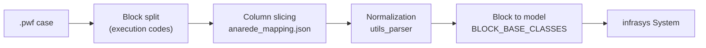

# o-grid

Open Power System Modeling & Optimization Framework.

`o-grid` reads Brazilian **ANAREDE** power-flow cases (`.pwf`) and turns them into
a typed, in-memory [`infrasys`](https://pypi.org/project/infrasys/) `System`. Each
ANAREDE execution block is mapped to a strongly-typed component model, so the raw
fixed-width text becomes queryable, validated Python objects that downstream
modeling and optimization code can consume.

## The parser approach

The parser is column-driven and declarative. Rather than hand-coding readers for
every ANAREDE block, `o-grid` describes each block once in a JSON mapping and
resolves the values into typed components:

1. **Read** the `.pwf` text and split it into execution-code blocks
   (`DBAR`, `DLIN`, `DGER`, ...).
2. **Slice** each record by fixed column ranges defined in
   [`config/anarede_mapping.json`](src/o_grid/config/anarede_mapping.json). Every
   field carries its `start`/`end` columns, a `default`, and a description drawn
   from the ANAREDE manual.
3. **Normalize** raw scalars (numeric coercion, implicit decimal points, state
   flags, circuit numbers) with the helpers in
   [`utils/utils_parser.py`](src/o_grid/utils/utils_parser.py).
4. **Map** each block to a component class through the `BLOCK_BASE_CLASSES`
   registry in [`models/__init__.py`](src/o_grid/models/__init__.py), attaching
   physical units (MW, MVAr, kV, p.u.) via [`units.py`](src/o_grid/units.py).
5. **Derive** specialized components from composite blocks — for example a single
   `DLIN` record becomes an `ACLine`, `LTCTransformer`, `PhaseShiftingTransformer`,
   `TransformerDevice`, or `SwitchDevice` depending on its tap and impedance fields.
6. **Populate** an `infrasys` `System` with the resulting components and their
   relationships (buses, arcs, areas, shunts, converters).



### Quick start

```python
from pathlib import Path

from r2x_core import DataStore, PluginContext

from o_grid import AnaredeConfig, AnaredeParser

data_path = Path("tests/data/anarede/d_33nodes.pwf")

config = AnaredeConfig(system_name="d_33nodes", pwf_path=str(data_path))
context = PluginContext(config=config, store=DataStore(path=data_path.parent))

system = AnaredeParser.from_context(context).run().system
```

The returned `system` is a standard `infrasys` `System`; query it with
`system.get_components(ACBus)` and friends. See the
[documentation](docs/) for a full walkthrough.

## ANAREDE blocks handled by the parser

The parser recognizes the following ANAREDE execution codes. Each block is sliced
by its column mapping and resolved into the typed component model shown below.

| Block | Component model | Purpose |
| --- | --- | --- |
| `TITU` | `CaseTitle` | System title and description information. |
| `DOPC` | `PowerFlowOption` | Power-flow execution options (option/state pairs). |
| `DCTE` | `ProgramConstant` | Program constants (mnemonic/value pairs). |
| `DBAR` | `ACBus` | AC buses. |
| `DLIN` | `ACLine` | AC circuits (lines & transformers). |
| `DLIN_TAP` | `LTCTransformer` | Load-tap-changing transformer derived from a `DLIN` tap range. |
| `DLIN_PHASE_SHIFT` | `PhaseShiftingTransformer` | Phase-shifting transformer derived from a `DLIN` phase angle. |
| `DLIN_TRANSFORMER` | `TransformerDevice` | Fixed-ratio transformer derived from a `DLIN` tap without a range. |
| `DLIN_SWITCH` | `SwitchDevice` | Switch/low-impedance element derived from a `DLIN` record. |
| `DGER` | `Generator` | Active power generation limits and participation factors. |
| `DGEI` | `IndividualizedGeneratorGroup` | Individualized generator group data. |
| `DCER` | `StaticVARCompensator` | Static reactive (VAr) compensator data. |
| `DCSC` | `ControllableSeriesCompensator` | Controllable Series Compensator (CSC) data. |
| `DCAI` | `IndividualizedLoad` | Individualized, voltage-dependent load groups. |
| `DBSH` | `BankController` | Capacitor/reactor bank controller for buses or lines. |
| `DBSH_BANK` | `ShuntBank` | Individual capacitor/reactor bank record (terminated by `FBAN`). |
| `DSHL` | `LineShunt` | AC-circuit terminal shunt devices. |
| `DARE` | `AreaInterchange` | Active power interchange limits between areas. |
| `DGBT` | `VoltageBaseGroup` | AC bus voltage base group definitions. |
| `DGLT` | `VoltageLimitGroup` | Voltage operating-limit group definitions. |
| `DCTR` | `TapTransformerControl` | Complementary control data for LTC/phase-shift transformers. |
| `DTPF` | `TransferFunctionConstraint` | Fixed automatic tap voltage-control (CTAP) data by element set. |
| `DTPF_CIRC` | `TransferFunctionCircuit` | Automatic tap voltage-control (CTAP) data by explicit circuit. |
| `DMFL_CIRC` | `FlowMonitoringCircuit` | AC circuit flow monitoring by explicit circuit. |
| `DMTE` | `VoltageMonitoringSelection` | AC bus voltage monitoring by selected element set. |
| `DCBA` | `DCBus` | DC bus data. |
| `DCLI` | `DCLine` | DC line data. |
| `DELO` | `DCLineData` | DC link data. |
| `DCNV` | `ConverterStation` | AC-DC converter data. |
| `DCCV` | `ConverterControl` | AC-DC converter control data. |

## Documentation

The full documentation lives in [`docs/`](docs/) and is built with
[Astro Starlight](https://starlight.astro.build/):

```bash
cd docs
npm install
npm run dev
```

It covers how to write a parser from
[`examples/parser_script.py`](examples/parser_script.py), the ANAREDE block
reference, and the power-system component models in
[`src/o_grid/models/`](src/o_grid/models/).

## Development

```bash
uv sync --all-groups
uv run pytest
```

## License

[MIT](LICENSE)
