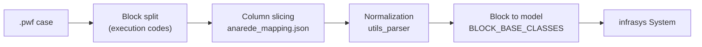

# o-grid

Open Power System Modeling & Optimization Framework.

`o-grid` reads power-flow cases and turns them into a typed, in-memory
[`infrasys`](https://pypi.org/project/infrasys/) `System`. Three static source formats are
supported:

- **ANAREDE**/**Organon** `.pwf` files — fixed-width text where each execution
  block (`DBAR`, `DLIN`, `DGER`, ...) is mapped to a strongly-typed component
  model, so the raw text becomes queryable, validated Python objects.
- **MATPOWER** `.m` files (via [`matpowercaseframes`](https://pypi.org/project/matpowercaseframes/))
  — the `bus`, `gen`, and `branch` tables are converted into the same typed
  component models, including bus shunt susceptance (`BS`), branch impedances,
  and transformer taps/phase shifts.
- **Organon** `.ntw` files — CSV-like network records mapped to dedicated NTW
   models such as `ShuntDevice`, `SeriesCapacitor`, `DCLink`, `Transformer`,
   `LineMutualImpedance`, and `FACTSDevice`.

ANAREDE dynamic-model `.dyn` files are also supported through a lossless
structured parser that returns dynamic model headers and records.
ANAREDE event `.evt` files are parsed into contingencies and ordered dynamic
events, and can drive the reduced-order stability simulation.

Across these paths, downstream modeling and optimization code consumes the same validated
`System`.

## The parser approach

The ANAREDE parser is column-driven and declarative. Rather than hand-coding
readers for every ANAREDE block, `o-grid` describes each block once in a JSON
mapping and resolves the values into typed components. The MATPOWER parser
(`o_grid.matpower`) follows the same "tables to typed components" idea, but reads
the tabular `bus`/`gen`/`branch` data with `matpowercaseframes` instead of column
slicing.

NTW files use the dedicated `NtwFileParser` in `o_grid.statics`. It supports
CP1252-encoded records, comma- and whitespace-delimited layouts, section
transitions, and transformer continuation records. Parsing logs each populated
section and the final component count through Loguru.

1. **Read** the `.pwf` text and split it into execution-code blocks
   (`DBAR`, `DLIN`, `DGER`, ...).
2. **Slice** each record by fixed column ranges defined in
   [`config/anarede_mapping.json`](src/o_grid/config/anarede_mapping.json). Every
   field carries its `start`/`end` columns, a `default`, and a description drawn
   from the PWF manual.
3. **Normalize** raw scalars (numeric coercion, implicit decimal points, state
   flags, circuit numbers) with the helpers in
   [`utils/utils_parser.py`](src/o_grid/utils/utils_parser.py).
4. **Map** each block to a component class through the `BLOCK_BASE_CLASSES`
   registry in [`models/__init__.py`](src/o_grid/models/__init__.py), attaching
   physical units (MW, MVAr, kV, p.u.) via [`units.py`](src/o_grid/units.py).
5. **Derive** specialized components from composite blocks — for example a single
   `DLIN` record becomes an `ACLine`, `LTCTransformer`, `PhaseShiftingTransformer`,
   `TransformerDevice`, or `SwitchDevice` depending on its tap and impedance fields.
6. **Populate** an `infrasys` `System` with the resulting components and their
   relationships (buses, arcs, areas, shunts, converters).



### Quick start

```python
from pathlib import Path

from r2x_core import DataStore, PluginContext

from o_grid import AnaredeConfig, AnaredeParser

data_path = Path("tests/data/pwf/d_33nodes.pwf")

config = AnaredeConfig(system_name="d_33nodes", pwf_path=str(data_path))
context = PluginContext(config=config, store=DataStore(path=data_path.parent))

system = AnaredeParser.from_context(context).run().system
```

The returned `system` is a standard `infrasys` `System`; query it with
`system.get_components(ACBus)` and friends. See the
[documentation](docs/) for a full walkthrough.

### Parse a MATPOWER case

MATPOWER `.m` cases are parsed with the same `System` API via
`parse_matpower_system` or the `MatPowerParser` plugin:

```python
from pathlib import Path

from o_grid import parse_matpower_system

data_path = Path("tests/data/mat/case_ACTIVSg10k.m")

parsed = parse_matpower_system(data_path)
system = parsed.system
```

`parse_matpower_system` returns a `ParsedAnaredeSystem` whose `.system` is a
standard `infrasys` `System` with the same typed components as the ANAREDE path,
so the power-flow and export steps below apply unchanged. The parser reads the
`bus`, `gen`, `branch`, and (when present) `dcline` tables, deriving
transformers, phase-shifting transformers, and switches from the branch records.
Bus shunt susceptance (`BS`) and conductance (`GS`) columns are mapped into the
bus shunt model.

```python
from o_grid import MatpowerConfig
from o_grid.plugin_parser import MatPowerParser
from r2x_core import DataStore, PluginContext

config = MatpowerConfig(system_name="case_ACTIVSg10k", pwf_path=str(data_path))
context = PluginContext(config=config, store=DataStore(path=data_path.parent))
system = MatPowerParser.from_context(context).run().system
```

### Parse an ANAREDE NTW case

```python
from pathlib import Path

from o_grid.statics import FACTSDevice, NtwFileParser, ShuntDevice

system = NtwFileParser(Path("case.NTW")).system
shunts = list(system.get_components(ShuntDevice))
facts = list(system.get_components(FACTSDevice))
```

The NTW parser reports populated sections and the final component count through
the project's Loguru logger.

### Parse an ANAREDE dynamic model file

```python
from pathlib import Path

from o_grid.dynamics import DynFileParser

dynamic_file = DynFileParser(Path("case.dyn")).file
for model in dynamic_file.models:
   print(model.model, model.name, len(model.records))
```

The `.dyn` parser preserves model headers, raw slash-terminated records, source
line numbers, and values converted to numeric types where possible. Unlike the
static parsers, it returns a `DynFile` rather than an `infrasys.System`.

### Run a stability study with an EVT contingency

```python
from pathlib import Path

from o_grid.dynamics import StabilityConfig, StabilityStudy, plot_stability_result

study = StabilityStudy(
   Path("tests/data/ntw/9bus.ntw"),
   Path("tests/data/dyn/9bus.dyn"),
   event_file=Path("tests/data/evt/9bus.evt"),
   contingency=2,
   config=StabilityConfig(duration=10.0, time_step=0.01, fault_factor=0.2),
)

power_flow = study.run_power_flow()
result = study.run()
figure = plot_stability_result(result)
figure.savefig("stability_9bus.png", dpi=150)
```

`StabilityStudy` solves the NTW operating point, initializes synchronous
machines from the DYN records, applies the selected EVT event timeline, and
returns time-domain trajectories and small-signal eigenvalues. The current
engine is a reduced-order classical swing-equation model: event records are
used to change the aggregate electrical transfer factor. Full network topology
mutation and detailed AVR, governor, PSS, and inverter models are future work.

### Run an AC power flow

Pass the parsed system directly to either pure-Python solver. The solver returns
the same `AnaredeSystem` with solved values and typed result components attached.

```python
from o_grid import ACBusResults
from o_grid.acpf import NewtonRaphsonPowerFlow

solved_system = NewtonRaphsonPowerFlow(
   system=system,
   print_iterations=True,
)

solved_system.info()
bus_results = list(solved_system.get_components(ACBusResults))
```

Use `FastDecoupledPowerFlow` instead of `NewtonRaphsonPowerFlow` to run the
fast-decoupled algorithm. `print_iterations=True` prints the convergence trace;
`solved_system.info()` renders component counts and the attached **Statistic
Results Information** table. See [Run an AC power flow](docs/src/content/docs/tutorials/run-power-flow.mdx)
for the complete parser-to-solution example.

### Run the primal-dual AC/DC OPF

`ACOptimalPowerFlow` formulates the network as a constrained nonlinear program
and solves it with Pyomo and Ipopt. The primal-dual interior-point method
optimizes AC voltage magnitudes and angles together with bounded reactive
generation, controls, and residual slacks. For cases with valid LCC HVDC data,
the same NLP also includes DC power, current, rectifier/inverter voltages,
converter angles, and reactive exchange. These equations are coupled directly
to the AC active and reactive power balances, making this an AC/DC OPF rather
than a sequential AC power flow followed by a DC update.

```python
from o_grid.acpf import ACOptimalPowerFlow

solved_system = ACOptimalPowerFlow(
   system=system,
   max_iterations=100,
   print_iterations=True,
)
```

The objective minimizes power-balance residuals and penalizes voltage, angle,
and control violations while regularizing the solution around the parsed
operating point. See the
[primal-dual AC/DC OPF explanation](docs/src/content/docs/explanation/optimization-acpf.mdx)
for the formulation and convergence details.

### Run a HiGHS DC-OPF

`DCOptimalPowerFlow` solves a linear DC optimal power-flow problem with
SciPy's open-source HiGHS backend. It dispatches active-power generators while
enforcing generator limits, nodal balance, reference angles, and branch-flow
limits.

```python
from o_grid import DCOptimalPowerFlow

run = DCOptimalPowerFlow(param_opt="cold_start").run(system)
print(run.result.converged, run.result.iterations)
```

The `param_opt` modes are `cold_start`, `hot_start`, `dcpf`, and `optimal`.
The first three implement the paper's cold-start, hot-start, and optimized-DCPF
parameter choices. `optimal` applies offline-trained `b`, `gamma`, and `rho`
values supplied through `DCOPFParameters`.

Branch thermal limits are enforced by default. If HiGHS reports infeasibility,
check the parsed generator and branch ratings; `enforce_branch_limits=False`
provides an explicit unconstrained-dispatch diagnostic mode.

See [DC optimal power flow](docs/src/content/docs/explanation/dc-optimal-power-flow.mdx)
and [examples/run_dcopf.py](examples/run_dcopf.py) for details.

### Export solved results to Excel

Write the solved power-flow results to an Excel workbook that follows the
reference result schema:

```python
from o_grid import ExportSolution

ExportSolution(
    system=solved_system,
    format="excel",
    output_path="power_flow_results.xlsx",
)
```

`ExportSolution` raises a `ValueError` if the system does not carry solved
power-flow results, and it creates the output directory when needed. The
workbook contains one sheet per result class — **Summary**, **Buses**,
**Generators**, **Loads**, **Lines**, **Transformers**, **LTC**, **PST**,
**HVDC**, **SVC**, and **CSC** — with a frozen header row and four-decimal
numeric formatting. Use `export_rows(rows)` to serialize result rows as
delimited text.

## PWF blocks handled by the parser

The ANAREDE parser recognizes the following PWF execution codes. Each block is sliced
by its column mapping and resolved into the typed component model shown below.
(MATPOWER cases use the same component models but are driven by the
`o_grid.matpower` table parser instead.)

| Block | Component model | Purpose |
| --- | --- | --- |
| `TITU` | `CaseTitle` | System title and description information. |
| `DOPC` | `PowerFlowOption` | Power-flow execution options (option/state pairs). |
| `DCTE` | `ProgramConstant` | Program constants (mnemonic/value pairs). |
| `DBAR` | `ACBus` | AC buses. |
| `DLIN` | `ACLine` | AC circuits (lines & transformers). |
| `DLIN_TAP` | `LTCTransformer` | Load-tap-changing transformer derived from a `DLIN` tap range. |
| `DLIN_PHASE_SHIFT` | `PhaseShiftingTransformer` | Phase-shifting transformer derived from a `DLIN` phase angle. |
| `DLIN_TRANSFORMER` | `TransformerDevice` | Fixed-ratio transformer derived from a `DLIN` tap without a range. |
| `DLIN_SWITCH` | `SwitchDevice` | Switch/low-impedance element derived from a `DLIN` record. |
| `DGER` | `Generator` | Active power generation limits and participation factors. |
| `DGEI` | `IndividualizedGeneratorGroup` | Individualized generator group data. |
| `DCER` | `StaticVARCompensator` | Static reactive (VAr) compensator data. |
| `DCSC` | `ControllableSeriesCompensator` | Controllable Series Compensator (CSC) data. |
| `DCAI` | `IndividualizedLoad` | Individualized, voltage-dependent load groups. |
| `DBSH` | `BankController` | Capacitor/reactor bank controller for buses or lines. |
| `DBSH_BANK` | `ShuntBank` | Individual capacitor/reactor bank record (terminated by `FBAN`). |
| `DSHL` | `LineShunt` | AC-circuit terminal shunt devices. |
| `DARE` | `AreaInterchange` | Active power interchange limits between areas. |
| `DGBT` | `VoltageBaseGroup` | AC bus voltage base group definitions. |
| `DGLT` | `VoltageLimitGroup` | Voltage operating-limit group definitions. |
| `DCTR` | `TapTransformerControl` | Complementary control data for LTC/phase-shift transformers. |
| `DTPF` | `TransferFunctionConstraint` | Fixed automatic tap voltage-control (CTAP) data by element set. |
| `DTPF_CIRC` | `TransferFunctionCircuit` | Automatic tap voltage-control (CTAP) data by explicit circuit. |
| `DMFL_CIRC` | `FlowMonitoringCircuit` | AC circuit flow monitoring by explicit circuit. |
| `DMTE` | `VoltageMonitoringSelection` | AC bus voltage monitoring by selected element set. |
| `DCBA` | `DCBus` | DC bus data. |
| `DCLI` | `DCLine` | DC line data. |
| `DELO` | `DCLineData` | DC link data. |
| `DCNV` | `ConverterStation` | AC-DC converter data. |
| `DCCV` | `ConverterControl` | AC-DC converter control data. |

## Documentation

The full documentation lives in [`docs/`](docs/) and is built with
[Astro Starlight](https://starlight.astro.build/):

```bash
cd docs
npm install
npm run dev
```

It covers how to write a parser from
[`examples/parser_script.py`](examples/parser_script.py), the ANAREDE block
reference, and the power-system component models in
[`src/o_grid/models/`](src/o_grid/models/).

## Development

```bash
uv sync --all-groups
uv run pytest
```

## License

[MIT](LICENSE)
