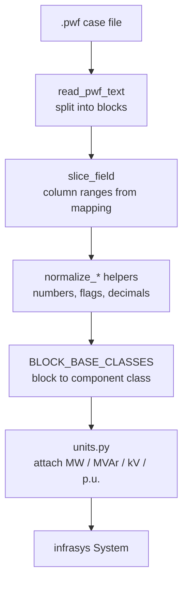
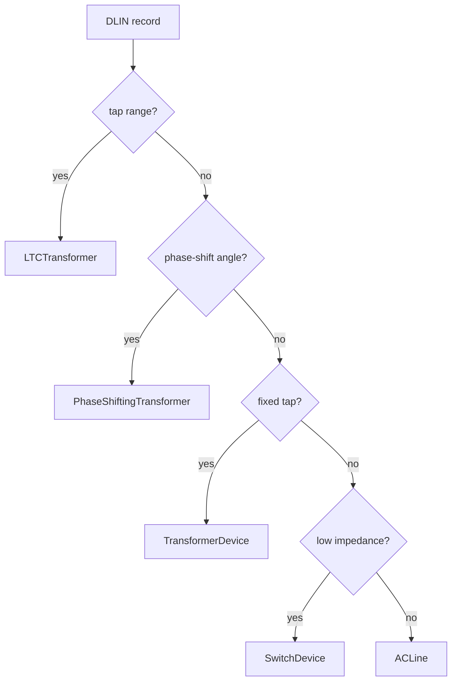

`o-grid`'s parser is **declarative and column-driven**. The knowledge of how to
read an ANAREDE case lives in data (a JSON mapping) and in the typed component
models, not in bespoke per-block reader functions. This page explains why and how.

## The problem

ANAREDE `.pwf` files are fixed-width text organized into *execution-code blocks*
(`DBAR`, `DLIN`, `DGER`, ...). Each block has its own record layout where a field
is defined by an inclusive column range, an implicit decimal point, and a default
value. Hand-writing a reader for every field of every block would be verbose,
error-prone, and hard to keep aligned with the ANAREDE manual.

## The approach

The parser separates three concerns:

1. **Where the data is** — column ranges and defaults, described once in
   [`config/anarede_mapping.json`](https://github.com/mcllerena/o-grid/blob/main/src/o_grid/config/anarede_mapping.json).
2. **What the data means** — typed, unit-carrying models in
   [`o_grid.models`](https://github.com/mcllerena/o-grid/blob/main/src/o_grid/models).
3. **How to connect them** — the `BLOCK_BASE_CLASSES` registry and normalization
   helpers.

## Stage by stage

### 1. Read and split

`read_pwf_text` loads the case and the parser groups records under their execution
code. Some codes use a repeated *mnemonic/value* pair form (`DCTE`, `DOPC`); others
are terminated by a sentinel (a `DBSH` bank list ends at `FBAN`).

### 2. Slice by column

Each field's `start`/`end` columns come straight from the mapping. Helpers like
`slice_field`, `parse_fixed_value`, and `parse_numeric` extract the substring and
apply the field's implicit decimal point where required. Missing fields fall back
to the mapping's `default`.

### 3. Normalize

Raw scalars are cleaned by dedicated helpers so the models receive canonical
values:

- `map_anarede_state_to_available` translates connection flags into the
  component's `available` field.
- `coerce_circuit_number` / `default_dcli_circuit` normalize circuit identifiers.
- `normalize_dbar_values`, `normalize_dlin_values`, `normalize_dger_values`, and
  siblings apply block-specific fixes before model construction.

### 4. Map blocks to models

`BLOCK_BASE_CLASSES` in
[`models/__init__.py`](https://github.com/mcllerena/o-grid/blob/main/src/o_grid/models/__init__.py)
maps each execution code to a component class. This is the single source of truth
for the block-to-model relationship.

### 5. Derive specialized components

Some blocks are polymorphic. A `DLIN` record can be an ordinary line or one of
several transformer/switch types. The parser inspects tap and impedance fields
(`has_tap_range`, `has_tap_value`, `has_non_zero_angle`, `is_switch_impedance`) and
emits the most specific class:

### 6. Attach units and build the system

Numeric fields are wrapped in the quantity types from
[`units.py`](https://github.com/mcllerena/o-grid/blob/main/src/o_grid/units.py)
(`ActivePower`, `ReactivePower`, `Voltage`, `Percentage`, ...), and the components
are added to an `infrasys` `System` along with their relationships (buses to arcs,
buses to areas, shunts to controllers).

## Why this design

- **The manual is the mapping.** Column positions and descriptions come directly
  from the ANAREDE reference, so the mapping doubles as documentation.
- **Adding or fixing a field requires no code change** — edit the JSON mapping.
- **Validation is free.** Because components are `pydantic` models, invalid values
  are rejected at construction and units are explicit.
- **Composability.** The parser is wrapped as an `r2x-core` plugin
  (`AnaredeParser` + `AnaredeConfig`), so it plugs into larger data pipelines.

## Extending the parser

- **Add a field to a block:** add its column range, default, and description to the
  block in `anarede_mapping.json`, then add the matching field to the component
  model.
- **Support a new block:** describe it in the mapping, create a model in
  `o_grid.models`, and register it in `BLOCK_BASE_CLASSES`.
- **Customize column layouts:** pass `mapping_path` to `AnaredeConfig` to load an
  alternative mapping without touching the parser.
